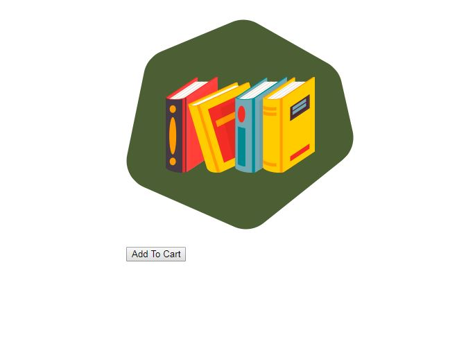

### Almost Amazon

## Technologies Used:

    * HTML5 
    * CSS 
    * JavaScript 

## Description 

This is a one page application with an image of a book and a button. Clicking the button will reveal the price for the book. 

## Screenshots

## Contributor

    * Feven Mulugeta

## Instructions 

1. Go to: `https://www.npmjs.com/package/http-server` and install "http-server".  
2. Navigate to the project folder in command line interface and type: `http-server -p 8080`  
3. This will show at: `http://localhost:8080` in your internet browser. 
